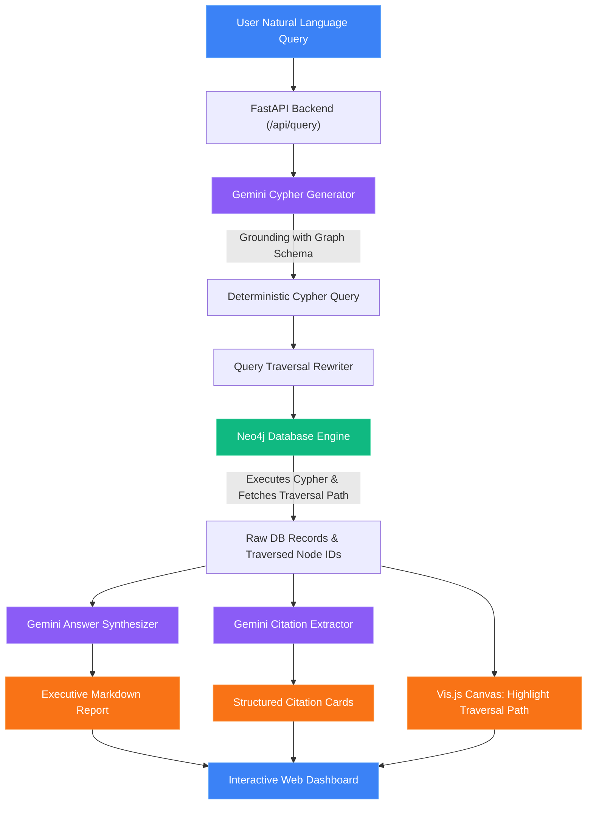
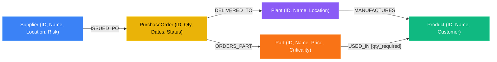

<p align="center">
  
</p>

<p align="center">
  <h1 align="center">Supply Chain Knowledge Graph RAG (GraphRAG)</h1>
  <p align="center">
    <strong>An Intelligent Graph-Native RAG System for Multi-Tier Supply Chain Risk Analysis, Dependency Tracing, and Bottleneck Discovery</strong>
  </p>
  <p align="center">
    <a href="https://www.python.org/"></a>
    <a href="https://fastapi.tiangolo.com/"></a>
    <a href="https://neo4j.com/"></a>
    <a href="https://ai.google.dev/"></a>
    <a href="https://visjs.org/"></a>
    <a href="LICENSE"></a>
  </p>
</p>

---

A **Knowledge Graph Retrieval-Augmented Generation (GraphRAG)** system designed to perform relational reasoning, multi-hop dependency tracing, and impact analysis across supply-chain networks.

Traditional vector-based RAG architectures perform similarity searches over isolated text chunks, making them incapable of traversing multi-tier relationships (e.g., discovering how a delayed capacitor from an upstream supplier impacts finished medical devices or EV chargers manufactured across global assembly plants). 

This system bridges that gap by modeling the entire supply chain as an interconnected property graph in **Neo4j**, translating natural language questions into precise **Cypher queries** using **Google Gemini**, executing graph traversals, and synthesizing comprehensive executive intelligence reports complete with interactive path visualizations and source audit trails.

---

# Screenshots & Interface

<sub>💡 The web dashboard provides real-time query pipeline progression, live graph visualization, path highlighting, and structured analyst reporting.</sub>

<table border="0">
  <tr>
    <td width="50%"><br/><sub><b>Global Supply Chain Map & Interactive Network</b></sub></td>
    <td width="50%"><br/><sub><b>Real-Time Dependency Tracing & Risk Analytics</b></sub></td>
  </tr>
</table>

---

## Features

- **Natural Language to Cypher Translation**: Converts complex supply-chain questions into deterministic Cypher queries with strict ontology grounding and zero SQL/Cypher hallucination.
- **Multi-Hop Dependency & Bottleneck Tracing**: Traces upstream purchase order delays across bills of materials (BOM) to pinpoint affected finished products and manufacturing facilities:
  ```text
  (Supplier) ──[:ISSUED_PO]──> (PurchaseOrder) ──[:ORDERS_PART]──> (Part) ──[:USED_IN]──> (Product)
  ```
- **Interactive Force-Directed & Hierarchical Graph Visualizer**: Built with **Vis.js**, supporting real-time physics simulation, zoom/pan controls, level-by-level hierarchical supply-chain flow layouts, and slide-in node property inspection.
- **Dynamic Search Path Highlighting**: Automatically rewrites queries during execution to isolate and highlight traversed graph nodes and relationships in neon accents.
- **Four-Stage Real-Time Stepper**: Visual execution progress tracker showing AI translation $\rightarrow$ database execution $\rightarrow$ graph path traversal $\rightarrow$ executive synthesis.
- **Traceability & Citations Audit Trail**: Structured citation cards linking every finding back to specific Purchase Orders, Suppliers, Component IDs, and Assembly Plants.
- **Executive Analyst Synthesis**: Converts raw graph database records into professional markdown reports with operational context, financial impact breakdowns, and actionable procurement recommendations.
- **Reproducible Synthetic ERP Data Generator**: Generates realistic supply-chain datasets with custom lead times, order statuses, criticality ratings, and BOM mappings.

---

## System Architecture



---

## Graph Schema & Property Ontology



### Entity Nodes
- **`Supplier`**: `id`, `name`, `location`, `risk_rating` (`Low`, `Medium`, `High`)
- **`Part`**: `id`, `name`, `category`, `unit_price`, `criticality` (`Low`, `Medium`, `High`)
- **`Plant`**: `id`, `name`, `location`
- **`Product`**: `id`, `name`, `customer`
- **`PurchaseOrder`**: `id`, `quantity`, `order_date`, `expected_delivery_date`, `actual_delivery_date`

### Directed Relationships
- `(:Supplier)-[:ISSUED_PO]->(:PurchaseOrder)`
- `(:PurchaseOrder)-[:ORDERS_PART]->(:Part)`
- `(:PurchaseOrder)-[:DELIVERED_TO]->(:Plant)`
- `(:Plant)-[:MANUFACTURES]->(:Product)`
- `(:Part)-[:USED_IN {quantity_required: INTEGER}]->(:Product)`

### Dynamic Computed Properties
- **Purchase Order Status**:
  - `Pending`: `actual_delivery_date` is empty / null.
  - `On-Time`: `actual_delivery_date <= expected_delivery_date`.
  - `Late`: `actual_delivery_date > expected_delivery_date`.
- **Order Financial Value**: `po.quantity * part.unit_price` (evaluated dynamically via `ORDERS_PART`).

---

## Project Structure

```text
.
├── generate_mock_data.py    # Synthetic ERP data generator (generates 6 relational CSVs)
├── upload_to_neo4j.py       # Neo4j ingestion script (creates nodes, constraints, and edges)
├── rag_pipeline.py          # Standalone CLI GraphRAG pipeline (terminal interactive mode)
├── server.py                # FastAPI backend serving REST endpoints & static web dashboard
├── requirements.txt         # Project dependencies
├── .env.example             # Environment variables template
├── .gitignore               # Comprehensive Git ignore rules
├── LICENSE                  # MIT License
├── README.md                # Project documentation
│
├── static/                  # Frontend assets for web dashboard
│   ├── index.html           # Split-pane UI layout (control panel & full-screen canvas)
│   ├── index.css            # Modern dark-mode styling and animations
│   └── app.js               # Vis.js graph network controller, stepper logic, and API handler
│
└── *.csv                    # Synthetic supply chain datasets (reproducible)
    ├── suppliers.csv        # Upstream component suppliers
    ├── parts.csv            # Catalog of electronic and mechanical parts
    ├── plants.csv           # Manufacturing & assembly facilities
    ├── products.csv         # Finished commercial products and customers
    ├── bom.csv              # Bill of materials mapping parts to products
    └── purchase_orders.csv  # Historical purchase orders and tracking dates
```

---

## Technologies Used

- **Graph Database**: [Neo4j AuraDB](https://neo4j.com/cloud/aura/) / Neo4j Community Server (Cypher Query Language)
- **Large Language Model**: [Google Gemini 3.6 Flash](https://ai.google.dev/) via `google-genai` SDK
- **Backend Framework**: [FastAPI](https://fastapi.tiangolo.com/), [Uvicorn](https://www.uvicorn.org/) (ASGI Server)
- **Data Modeling & Validation**: [Pydantic v2](https://docs.pydantic.dev/)
- **Data Engineering**: [Pandas](https://pandas.pydata.org/), [NumPy](https://numpy.org/)
- **Frontend Visualization**: [Vis.js Network](https://visjs.org/), Modern Vanilla JavaScript (ES6+), CSS3 Grid/Flexbox
- **Markdown Parsing**: [Marked.js](https://marked.js.org/)

---

## Installation & Setup

### 1. Clone & Set Up Environment

```bash
git clone https://github.com/<your-username>/supply-chain-graphrag.git
cd supply-chain-graphrag

# Create virtual environment
python -m venv .venv

# Activate virtual environment
# On Windows (PowerShell):
.\.venv\Scripts\Activate.ps1
# On Linux / macOS:
source .venv/bin/activate

# Install dependencies
pip install -r requirements.txt
```

### 2. Configure Environment Variables

Copy the template configuration file:

```bash
cp .env.example .env
```

Open `.env` and fill in your credentials:

```env
# Neo4j Database Configuration
NEO4J_URI=neo4j+s://<your-instance-id>.databases.neo4j.io
NEO4J_USERNAME=neo4j
NEO4J_PASSWORD=your-neo4j-password
NEO4J_DATABASE=neo4j

# Google Gemini API Configuration
GEMINI_API_KEY=your-gemini-api-key
GEMINI_MODEL=gemini-3.6-flash
```

> **Note**: For local Neo4j Desktop or Docker, set `NEO4J_URI=bolt://localhost:7687`.

---

## Data Ingestion & Execution

### 1. Generate Synthetic Datasets
Generate fresh synthetic supply-chain data (suppliers, parts, plants, products, BOM, purchase orders):

```bash
python generate_mock_data.py
```

### 2. Ingest Data into Neo4j
Clear and upload all nodes, properties, and directed relationships into your Neo4j database:

```bash
python upload_to_neo4j.py
```

### 3. Run Standalone CLI Pipeline
Test queries directly in your terminal:

```bash
python rag_pipeline.py
```

```text
=== Supply Chain GraphRAG System ===
Type your question below (or 'exit' to quit).

Ask a question: Which products are affected by Supplier Alpha's late deliveries?

[1/4] User Question: 'Which products are affected by Supplier Alpha's late deliveries?'
[2/4] Generated Cypher Query:
MATCH (s:Supplier)-[:ISSUED_PO]->(po:PurchaseOrder)-[:ORDERS_PART]->(p:Part)-[:USED_IN]->(pr:Product)
WHERE toLower(s.name) = 'supplier alpha' AND po.actual_delivery_date > po.expected_delivery_date
RETURN DISTINCT pr.name AS affected_product, p.name AS delayed_part, po.id AS po_id

[3/4] Database Results: [{'affected_product': 'Smart Gateway', 'delayed_part': 'USB-C Connector', 'po_id': 'PO00005'}]

[4/4] Analyst Response:
**Smart Gateway** is directly impacted by late deliveries from **Supplier Alpha**...
```

### 4. Launch the Web Dashboard & Visualizer
Start the FastAPI server:

```bash
python server.py
```
Open **[http://127.0.0.1:8000](http://127.0.0.1:8000)** in your browser.

---

## Interactive Web Dashboard Walkthrough

```text
┌──────────────────────────────────────┬────────────────────────────────────────────────────────┐
│  CONTROL PANEL                       │  INTERACTIVE GRAPH CANVAS                              │
│                                      │                                                        │
│  [Ask a supply chain risk question]  │   (Supplier) ──> (PO) ──> (Part) ──> (Product)        │
│  [Demo Queries]                      │         │                                              │
│                                      │         └──> (Plant)                                   │
│  ▼ 4-Stage Execution Stepper         │                                                        │
│    ✓ Cypher Generation               │   [Reset View]  [Hierarchical Flow]                    │
│    ✓ Database Execution              │   Legend: ● Supplier ● PO ● Part ● Product ● Plant     │
│    ✓ Path Traversal                  │                                                        │
│    ✓ Answer Synthesis                │  ┌──────────────────────────────┐                      │
│                                      │  │ Node Details Sidebar         │                      │
│  ▼ Generated Cypher Code             │  │ Part: STM32 Microcontroller  │                      │
│  ▼ Raw Database Results              │  │ Category: Semiconductor      │                      │
│  ▼ Executive Analyst Report          │  │ Criticality: High            │                      │
│  ▼ Source Traceability Cards         │  │ Unit Price: $12.50           │                      │
│                                      │  └──────────────────────────────┘                      │
└──────────────────────────────────────┴────────────────────────────────────────────────────────┘
```

1. **Natural Language Query Console**: Submit arbitrary questions or select one-click demo presets.
2. **Real-time Pipeline Stepper**: Visual indicators activate as Gemini writes Cypher, Neo4j queries the graph, and the response is synthesized.
3. **Cypher & Hop Inspection**: View the exact generated Cypher query and logical entity hops.
4. **Interactive Graph Visualizer**: Pan, zoom, and drag nodes. Switch between **Force-Directed** and **Left-to-Right Hierarchical Flow** layouts.
5. **Dynamic Traversal Isolation**: Submitting a query isolates and animates only the traversed nodes and relationships involved in answering the question.
6. **Node Property Sidebar**: Click any node on the graph canvas to inspect its full metadata and properties.
7. **Traceability Cards**: Review audit trails showing PO IDs, supplier details, and impacted assembly lines.

---

## Example Queries & Traversal Logic

| Natural Language Query | Cypher Graph Traversal Path | Business Rationale |
|---|---|---|
| *"Which products are affected by Supplier Alpha's late deliveries?"* | `(Supplier)-[:ISSUED_PO]->(PO)-[:ORDERS_PART]->(Part)-[:USED_IN]->(Product)` | Identifies finished goods at risk of shipment delays due to component stockouts. |
| *"Find all pending purchase orders containing High criticality parts and tell me which plants they go to."* | `(PO)-[:ORDERS_PART]->(Part {criticality: 'High'})` and `(PO)-[:DELIVERED_TO]->(Plant)` | Highlights vulnerable manufacturing plants awaiting critical assembly inputs. |
| *"Calculate the total order value of all late purchase orders."* | `MATCH (po:PurchaseOrder)-[:ORDERS_PART]->(p:Part) WHERE po.actual_delivery_date > po.expected_delivery_date RETURN sum(po.quantity * p.unit_price)` | Quantifies capital tied up in delayed purchase orders. |
| *"What parts does Supplier Gamma provide and what products use them?"* | `(s:Supplier {name: 'Supplier Gamma'})-[:ISSUED_PO]->(po)-[:ORDERS_PART]->(p)-[:USED_IN]->(pr)` | Maps supplier exposure and product dependency concentration. |

---

## Limitations

- **Schema Evolution**: Queries rely on the documented graph schema in prompts; schema migrations require updating the schema prompt definition.
- **Single-Turn Interactions**: The web interface processes queries independently without persistent multi-turn conversational session context.
- **Deterministic Cypher Generation**: Highly ambiguous questions with missing constraints may require user clarification or prompt re-anchoring.

---

## Future Work

- **Hybrid Vector + Graph Retrieval**: Combine vector embeddings over unstructured supplier contracts and compliance PDFs with graph traversal (Hybrid GraphRAG).
- **Multi-turn Conversational Memory**: Introduce session-based conversational state memory for iterative graph exploration.
- **Automated Root-Cause Simulation**: What-if scenario analysis simulating the downstream blast radius if a specific port or supplier suffers an outage.
- **Streaming LLM Responses**: Server-sent events (SSE) streaming for instantaneous word-by-word analyst response rendering.

---

## License

This project is licensed under the [MIT License](LICENSE).
